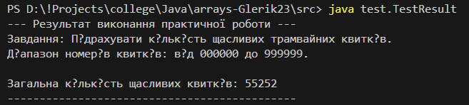

# Практична робота "Масиви, вирази, керування виконанням програми"

Цей репозиторій містить рішення для практичної роботи, сфокусованої на використанні масивів (хоча у вибраному завданні масиви явно не використовуються, але логіка роботи з цифрами числа схожа на роботу з елементами послідовності/масиву), виразів та керуючих конструкцій (цикли, умови) у Java.

Було обрано завдання: **Знайти кількість щасливих трамвайних квитків**.

## Завдання

Завдання полягає у підрахунку загальної кількості "щасливих" трамвайних квитків у діапазоні номерів від 000000 до 999999. Трамвайний квиток вважається "щасливим", якщо сума перших трьох цифр його шестизначного номера дорівнює сумі останніх трьох цифр.

Приклади щасливих квитків:
* `123321` (1+2+3 = 6, 3+2+1 = 6)
* `000000` (0+0+0 = 0, 0+0+0 = 0)
* `999999` (9+9+9 = 27, 9+9+9 = 27)
* `010100` (0+1+0 = 1, 1+0+0 = 1)

## Опис реалізації

Завдання реалізовано у статичному методі `Calculate` класу `Exercise`.

1.  **Клас `Exercise`:**
    * Містить статичний метод `public static int Calculate()`. Цей метод не приймає вхідних параметрів, оскільки діапазон номерів квитків (від 000000 до 999999) є фіксованим за умовою завдання. Метод повертає ціле число типу `int`, яке представляє загальну кількість знайдених "щасливих" квитків.
    * Основна логіка реалізована за допомогою циклу `for`, який ітерується через усі можливі шестизначні номери від 0 до 999999.
    * Всередині циклу для кожного числа (номера квитка) виконується витягнення окремих цифр. Це досягається за допомогою комбінації операторів ділення (`/`) та знаходження остачі (`%`) на 10 та степені 10. Цей підхід є більш ефективним порівняно з перетворенням числа в рядок на кожній ітерації.
    * Після витягнення цифр обчислюються дві суми: сума перших трьох цифр і сума останніх трьох цифр.
    * Використовується умовний оператор `if` для порівняння цих двох сум. Якщо суми рівні, лічильник щасливих квитків (`happyTicketCount`) збільшується на одиницю.
    * Після завершення циклу, що охоплює всі можливі номери квитків, метод повертає фінальне значення лічильника.
    * Додані відповідні Javadoc коментарі для класу та методу, які пояснюють їх призначення та роботу.
    * Обрані типи даних (`int`) є оптимальними для цього завдання, оскільки максимальна сума трьох цифр (27) і максимальна кількість щасливих квитків (точно 55252) легко вміщуються в діапазон `int`.

2.  **Клас `TestResult`:**
    * Містить стандартний метод `public static void main(String[] args)`, який слугує точкою входу для виконання програми.
    * У цьому методі відбувається виклик статичного методу `Exercise.Calculate()` для отримання результату обчислення кількості щасливих квитків.
    * Результат обчислення (кількість щасливих квитків) виводиться на консоль у вигляді інформативного повідомлення, що відповідає специфіці завдання.

## Приклад використання



**Виконання програми (після компіляції):**

Припускаючи, що ви скомпілювали класи і знаходитесь у кореневій директорії проєкту (наприклад, `methods-Glerik23`), ви можете запустити програму командою:

```bash
java test.TestResult